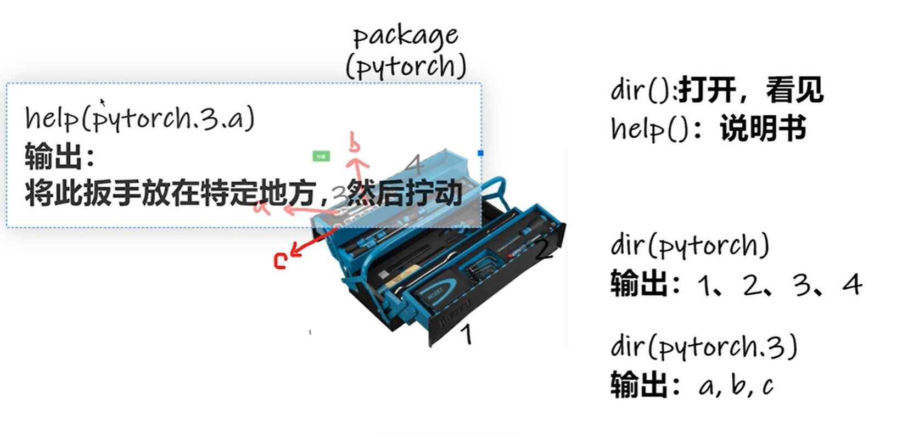
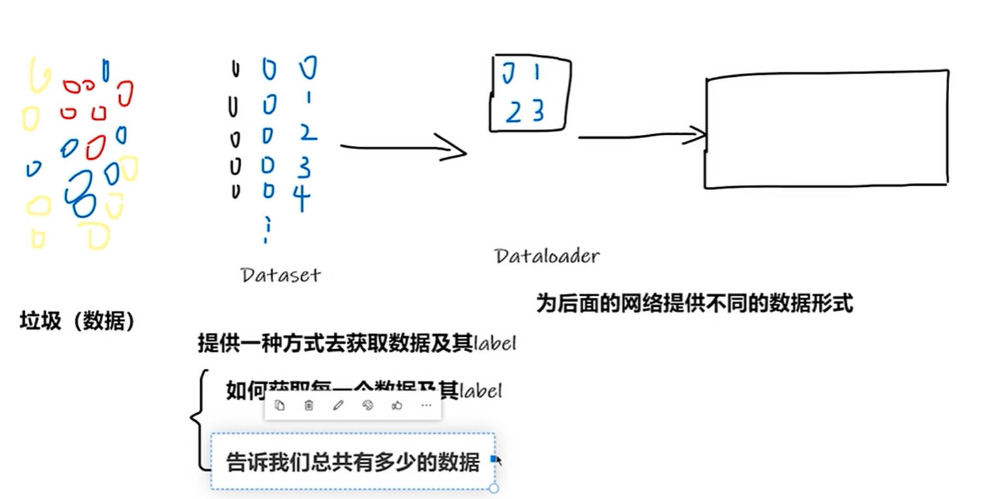

## 1. Python学习中的两大法宝函数（当然可以用在pytorch）



dir()函数可以看箱子里有什么工具，help()函数告诉我们这个工具怎么用

代码示例及输出：

```python
>>> import torch
>>> torch.cuda.is_available
<function is_available at 0x0000021BE0276C10>
>>> torch.cuda.is_available()
False
>>> dir(torch)
['AVG', 'AggregationType', 'AnyType', 'Argument', 'ArgumentSpec', 'BFloat16Storage', 'BFloat16Tensor', 'BenchmarkConfig', 'BenchmarkExecutionStats', 'Block', 'BoolStorage', 'BoolTensor', 'BoolType', 'BufferDict', 'ByteStorage', 'ByteTensor', 'CONV_BN_FUSION', 'CallStack', 'Capsule', 'CharStorage', 'CharTensor', 'ClassType', 'Code', 'CompilationUnit', 'CompleteArgumentSpec', 'ComplexDoubleStorage', 'ComplexFloatStorage', 'ComplexType', 'ConcreteModuleType', 'ConcreteModuleTypeBuilder', 'DeepCopyMemoTable', 'DeviceObjType', 'DictType', 'DisableTorchFunction', 'DoubleStorage', 'DoubleTensor', 'EnumType', 'ErrorReport', 'ExecutionPlan', 'FUSE_ADD_RELU', 'FatalError', 'FileCheck', 'FloatStorage', 'FloatTensor', 'FloatType', 'FunctionSchema', 'Future', 'FutureType', 'Generator', 'Gradient', 'Graph', 'GraphExecutorState', 'HOIST_CONV_PACKED_PARAMS', 'HalfStorage', 'HalfStorageBase', 'HalfTensor', 'INSERT_FOLD_PREPACK_OPS', 'IODescriptor', 'InferredType', 'IntStorage', 'IntTensor', 'IntType', 'InterfaceType', 'JITException', 'ListType', 'LiteScriptModule', 'LockingLogger', 'LoggerBase', 'LongStorage', 'LongTensor', 'MobileOptimizerType', 'ModuleDict', 'Node', 'NoneType', 'NoopLogger', 'NumberType', 'OptionalType', 'ParameterDict', 'PyObjectType', 'PyTorchFileReader', 'PyTorchFileWriter', 'QInt32Storage', 'QInt32StorageBase', 'QInt8Storage', 'QInt8StorageBase', 'QUInt4x2Storage', 'QUInt8Storage', 'REMOVE_DROPOUT', 'RRefType', 'SUM', 'ScriptClass', 'ScriptFunction', 'ScriptMethod', 'ScriptModule', 'ScriptObject', 'Set', 'ShortStorage', 'ShortTensor', 'Size', 'StaticRuntime', 'Storage', 'Stream', 'StreamObjType', 'StringType', 'TYPE_CHECKING', 'Tensor', 'TensorType', 'ThroughputBenchmark', 'TracingState', 'TupleType', 'Type', 'USE_GLOBAL_DEPS', 'USE_RTLD_GLOBAL_WITH_LIBTORCH', 'Use', 'Value', '_C', '_StorageBase', '_VF', '__all__', '__annotations__', '__builtins__', '__cached__', '__config__', '__doc__', '__file__', '__future__', '__loader__', '__name__', '__package__', '__path__', '__spec__', '__version__', '_adaptive_avg_pool2d', '_add_batch_dim', '_add_relu', '_add_relu_', '_addmv_impl_', '_aminmax', '_amp_foreach_non_finite_check_and_unscale_', '_amp_update_scale', '_assert', '_autograd_functions', '_baddbmm_mkl_', '_batch_norm_impl_index', '_bmm', '_cast_Byte', '_cast_Char', '_cast_Double', '_cast_Float', '_cast_Half', '_cast_Int', '_cast_Long', '_cast_Short', '_cat', '_choose_qparams_per_tensor', '_classes', '_compute_linear_combination', '_conj', '_convolution', '_convolution_nogroup', '_copy_from', '_ctc_loss', '_cudnn_ctc_loss', '_cudnn_init_dropout_state', '_cudnn_rnn', '_cudnn_rnn_flatten_weight', '_cufft_clear_plan_cache', '_cufft_get_plan_cache_max_size', '_cufft_get_plan_cache_size', '_cufft_set_plan_cache_max_size', '_cummax_helper', '_cummin_helper', '_debug_has_internal_overlap', '_dim_arange', '_dirichlet_grad', '_embedding_bag', '_embedding_bag_forward_only', '_empty_affine_quantized', '_empty_per_channel_affine_quantized', '_euclidean_dist', '_fake_quantize_learnable_per_channel_affine', '_fake_quantize_learnable_per_tensor_affine', '_fft_c2c', '_fft_c2r', '_fft_r2c', '_foreach_abs', '_foreach_abs_', '_foreach_acos', '_foreach_acos_', '_foreach_add', '_foreach_add_', '_foreach_addcdiv', '_foreach_addcdiv_', '_foreach_addcmul', '_foreach_addcmul_', '_foreach_asin', '_foreach_asin_', '_foreach_atan', '_foreach_atan_', '_foreach_ceil', '_foreach_ceil_', '_foreach_cos', '_foreach_cos_', '_foreach_cosh', '_foreach_cosh_', '_foreach_div', '_foreach_div_', '_foreach_erf', '_foreach_erf_', '_foreach_erfc', '_foreach_erfc_', '_foreach_exp', '_foreach_exp_', '_foreach_expm1', '_foreach_expm1_', '_foreach_floor', '_foreach_floor_', '_foreach_frac', '_foreach_frac_', '_foreach_lgamma', '_foreach_lgamma_', '_foreach_log', '_foreach_log10', '_foreach_log10_', '_foreach_log1p', '_foreach_log1p_', '_foreach_log2', '_foreach_log2_', '_foreach_log_', '_foreach_maximum', '_foreach_minimum', '_foreach_mul', '_foreach_mul_', '_foreach_neg', '_foreach_neg_', '_foreach_reciprocal', '_foreach_reciprocal_', '_foreach_round', '_foreach_round_', '_foreach_sigmoid', '_foreach_sigmoid_', '_foreach_sin', '_foreach_sin_', '_foreach_sinh', '_foreach_sinh_', '_foreach_sqrt', '_foreach_sqrt_', '_foreach_sub', '_foreach_sub_', '_foreach_tan', '_foreach_tan_', '_foreach_tanh', '_foreach_tanh_', '_foreach_trunc', '_foreach_trunc_', '_foreach_zero_', '_fused_dropout', '_grid_sampler_2d_cpu_fallback', '_has_compatible_shallow_copy_type', '_import_dotted_name', '_index_copy_', '_index_put_impl_', '_initExtension', '_jit_internal', '_linalg_inv_out_helper_', '_linalg_qr_helper', '_linalg_solve_out_helper_', '_linalg_utils', '_load_global_deps', '_lobpcg', '_log_softmax', '_log_softmax_backward_data', '_logcumsumexp', '_lowrank', '_lu_solve_helper', '_lu_with_info', '_make_dual', '_make_per_channel_quantized_tensor', '_make_per_tensor_quantized_tensor', '_masked_scale', '_mkldnn', '_mkldnn_reshape', '_mkldnn_transpose', '_mkldnn_transpose_', '_mode', '_namedtensor_internals', '_nnpack_available', '_nnpack_spatial_convolution', '_ops', '_pack_padded_sequence', '_pad_packed_sequence', '_remove_batch_dim', '_reshape_from_tensor', '_rowwise_prune', '_s_where', '_sample_dirichlet', '_saturate_weight_to_fp16', '_shape_as_tensor', '_six', '_sobol_engine_draw', '_sobol_engine_ff_', '_sobol_engine_initialize_state_', '_sobol_engine_scramble_', '_softmax', '_softmax_backward_data', '_sparse_addmm', '_sparse_coo_tensor_unsafe', '_sparse_log_softmax', '_sparse_log_softmax_backward_data', '_sparse_matrix_mask_helper', '_sparse_mm', '_sparse_softmax', '_sparse_softmax_backward_data', '_sparse_sparse_matmul', '_sparse_sum', '_stack', '_standard_gamma', '_standard_gamma_grad', '_std', '_storage_classes', '_string_classes', '_syevd_helper', '_tensor_classes', '_tensor_str', '_test_serialization_subcmul', '_trilinear', '_unique', '_unique2', '_unpack_dual', '_use_cudnn_ctc_loss', '_use_cudnn_rnn_flatten_weight', '_utils', '_utils_internal', '_validate_sparse_coo_tensor_args', '_var', '_vmap_internals', '_weight_norm', '_weight_norm_cuda_interface', 'abs', 'abs_', 'absolute', 'acos', 'acos_', 'acosh', 'acosh_', 'adaptive_avg_pool1d', 'adaptive_max_pool1d', 'add', 'addbmm', 'addcdiv', 'addcmul', 'addmm', 'addmv', 'addmv_', 'addr', 'affine_grid_generator', 'align_tensors', 'all', 'allclose', 'alpha_dropout', 'alpha_dropout_', 'amax', 'amin', 'angle', 'any', 'arange', 'arccos', 'arccos_', 'arccosh', 'arccosh_', 'arcsin', 'arcsin_', 'arcsinh', 'arcsinh_', 'arctan', 'arctan_', 'arctanh', 'arctanh_', 'are_deterministic_algorithms_enabled', 'argmax', 'argmin', 'argsort', 'as_strided', 'as_strided_', 'as_tensor', 'asin', 'asin_', 'asinh', 'asinh_', 'atan', 'atan2', 'atan_', 'atanh', 'atanh_', 'atleast_1d', 'atleast_2d', 'atleast_3d', 'autocast_decrement_nesting', 'autocast_increment_nesting', 'autograd', 'avg_pool1d', 'backends', 'baddbmm', 'bartlett_window', 'base_py_dll_path', 'batch_norm', 'batch_norm_backward_elemt', 'batch_norm_backward_reduce', 'batch_norm_elemt', 'batch_norm_gather_stats', 'batch_norm_gather_stats_with_counts', 'batch_norm_stats', 'batch_norm_update_stats', 'bernoulli', 'bfloat16', 'bilinear', 'binary_cross_entropy_with_logits', 'bincount', 'binomial', 'bitwise_and', 'bitwise_not', 'bitwise_or', 'bitwise_xor', 'blackman_window', 'block_diag', 'bmm', 'bool', 'broadcast_shapes', 'broadcast_tensors', 'broadcast_to', 'bucketize', 'can_cast', 'cartesian_prod', 'cat', 'cdist', 'cdouble', 'ceil', 'ceil_', 'celu', 'celu_', 'cfloat', 'chain_matmul', 'channel_shuffle', 'channels_last', 'channels_last_3d', 'cholesky', 'cholesky_inverse', 'cholesky_solve', 'choose_qparams_optimized', 'chunk', 'clamp', 'clamp_', 'clamp_max', 'clamp_max_', 'clamp_min', 'clamp_min_', 'classes', 'clear_autocast_cache', 'clip', 'clip_', 'clone', 'column_stack', 'combinations', 'compiled_with_cxx11_abi', 'complex', 'complex128', 'complex32', 'complex64', 'conj', 'constant_pad_nd', 'contiguous_format', 'conv1d', 'conv2d', 'conv3d', 'conv_tbc', 'conv_transpose1d', 'conv_transpose2d', 'conv_transpose3d', 'convolution', 'copysign', 'cos', 'cos_', 'cosh', 'cosh_', 'cosine_embedding_loss', 'cosine_similarity', 'count_nonzero', 'cpp', 'cross', 'ctc_loss', 'ctypes', 'cuda', 'cuda_path', 'cuda_version', 'cudnn_affine_grid_generator', 'cudnn_batch_norm', 'cudnn_convolution', 'cudnn_convolution_transpose', 'cudnn_grid_sampler', 'cudnn_is_acceptable', 'cummax', 'cummin', 'cumprod', 'cumsum', 'default_generator', 'deg2rad', 'deg2rad_', 'dequantize', 'det', 'detach', 'detach_', 'device', 'diag', 'diag_embed', 'diagflat', 'diagonal', 'diff', 'digamma', 'dist', 'distributed', 'distributions', 'div', 'divide', 'dll', 'dll_path', 'dll_paths', 'dlls', 'dot', 'double', 'dropout', 'dropout_', 'dsmm', 'dstack', 'dtype', 'eig', 'einsum', 'embedding', 'embedding_bag', 'embedding_renorm_', 'empty', 'empty_like', 'empty_meta', 'empty_quantized', 'empty_strided', 'enable_grad', 'eq', 'equal', 'erf', 'erf_', 'erfc', 'erfc_', 'erfinv', 'exp', 'exp2', 'exp2_', 'exp_', 'expm1', 'expm1_', 'eye', 'fake_quantize_per_channel_affine', 'fake_quantize_per_tensor_affine', 'fbgemm_linear_fp16_weight', 'fbgemm_linear_fp16_weight_fp32_activation', 'fbgemm_linear_int8_weight', 'fbgemm_linear_int8_weight_fp32_activation', 'fbgemm_linear_quantize_weight', 'fbgemm_pack_gemm_matrix_fp16', 'fbgemm_pack_quantized_matrix', 'feature_alpha_dropout', 'feature_alpha_dropout_', 'feature_dropout', 'feature_dropout_', 'fft', 'fill_', 'finfo', 'fix', 'fix_', 'flatten', 'flip', 'fliplr', 'flipud', 'float', 'float16', 'float32', 'float64', 'float_power', 'floor', 'floor_', 'floor_divide', 'fmax', 'fmin', 'fmod', 'fork', 'frac', 'frac_', 'frobenius_norm', 'from_file', 'from_numpy', 'full', 'full_like', 'functional', 'futures', 'gather', 'gcd', 'gcd_', 'ge', 'geqrf', 'ger', 'get_default_dtype', 'get_device', 'get_file_path', 'get_num_interop_threads', 'get_num_threads', 'get_rng_state', 'glob', 'greater', 'greater_equal', 'grid_sampler', 'grid_sampler_2d', 'grid_sampler_3d', 'group_norm', 'gru', 'gru_cell', 'gt', 'half', 'hamming_window', 'hann_window', 'hardshrink', 'has_cuda', 'has_cudnn', 'has_lapack', 'has_mkl', 'has_mkldnn', 'has_openmp', 'heaviside', 'hinge_embedding_loss', 'histc', 'hsmm', 'hspmm', 'hstack', 'hub', 'hypot', 'i0', 'i0_', 'igamma', 'igammac', 'iinfo', 'imag', 'import_ir_module', 'import_ir_module_from_buffer', 'index_add', 'index_copy', 'index_fill', 'index_put', 'index_put_', 'index_select', 'init_num_threads', 'initial_seed', 'inner', 'instance_norm', 'int', 'int16', 'int32', 'int64', 'int8', 'int_repr', 'inverse', 'is_anomaly_enabled', 'is_autocast_enabled', 'is_complex', 'is_deterministic', 'is_distributed', 'is_floating_point', 'is_grad_enabled', 'is_loaded', 'is_nonzero', 'is_same_size', 'is_signed', 'is_storage', 'is_tensor', 'is_vulkan_available', 'isclose', 'isfinite', 'isinf', 'isnan', 'isneginf', 'isposinf', 'isreal', 'istft', 'jit', 'kaiser_window', 'kernel32', 'kl_div', 'kron', 'kthvalue', 'last_error', 'layer_norm', 'layout', 'lcm', 'lcm_', 'ldexp', 'ldexp_', 'le', 'legacy_contiguous_format', 'lerp', 'less', 'less_equal', 'lgamma', 'linalg', 'linspace', 'load', 'lobpcg', 'log', 'log10', 'log10_', 'log1p', 'log1p_', 'log2', 'log2_', 'log_', 'log_softmax', 'logaddexp', 'logaddexp2', 'logcumsumexp', 'logdet', 'logical_and', 'logical_not', 'logical_or', 'logical_xor', 'logit', 'logit_', 'logspace', 'logsumexp', 'long', 'lstm', 'lstm_cell', 'lstsq', 'lt', 'lu', 'lu_solve', 'lu_unpack', 'manual_seed', 'margin_ranking_loss', 'masked_fill', 'masked_scatter', 'masked_select', 'matmul', 'matrix_exp', 'matrix_power', 'matrix_rank', 'max', 'max_pool1d', 'max_pool1d_with_indices', 'max_pool2d', 'max_pool3d', 'maximum', 'mean', 'median', 'memory_format', 'merge_type_from_type_comment', 'meshgrid', 'min', 'minimum', 'miopen_batch_norm', 'miopen_convolution', 'miopen_convolution_transpose', 'miopen_depthwise_convolution', 'miopen_rnn', 'mkldnn_adaptive_avg_pool2d', 'mkldnn_convolution', 'mkldnn_convolution_backward_weights', 'mkldnn_linear_backward_weights', 'mkldnn_max_pool2d', 'mkldnn_max_pool3d', 'mm', 'mode', 'moveaxis', 'movedim', 'msort', 'mul', 'multinomial', 'multiply', 'multiprocessing', 'mv', 'mvlgamma', 'name', 'nan_to_num', 'nan_to_num_', 'nanmedian', 'nanquantile', 'nansum', 'narrow', 'narrow_copy', 'native_batch_norm', 'native_group_norm', 'native_layer_norm', 'native_norm', 'ne', 'neg', 'neg_', 'negative', 'negative_', 'nextafter', 'nn', 'no_grad', 'nonzero', 'norm', 'norm_except_dim', 'normal', 'not_equal', 'nuclear_norm', 'numel', 'nvtoolsext_dll_path', 'ones', 'ones_like', 'onnx', 'ops', 'optim', 'orgqr', 'ormqr', 'os', 'outer', 'overrides', 'pairwise_distance', 'parse_ir', 'parse_schema', 'parse_type_comment', 'path_patched', 'pca_lowrank', 'pdist', 'per_channel_affine', 'per_channel_affine_float_qparams', 'per_channel_symmetric', 'per_tensor_affine', 'per_tensor_symmetric', 'pfiles_path', 'pinverse', 'pixel_shuffle', 'pixel_unshuffle', 'platform', 'poisson', 'poisson_nll_loss', 'polar', 'polygamma', 'pow', 'prelu', 'prepare_multiprocessing_environment', 'preserve_format', 'prev_error_mode', 'prod', 'profiler', 'promote_types', 'py_dll_path', 'q_per_channel_axis', 'q_per_channel_scales', 'q_per_channel_zero_points', 'q_scale', 'q_zero_point', 'qint32', 'qint8', 'qr', 'qscheme', 'quantile', 'quantization', 'quantize_per_channel', 'quantize_per_tensor', 'quantized_batch_norm', 'quantized_gru', 'quantized_gru_cell', 'quantized_lstm', 'quantized_lstm_cell', 'quantized_max_pool1d', 'quantized_max_pool2d', 'quantized_rnn_relu_cell', 'quantized_rnn_tanh_cell', 'quasirandom', 'quint4x2', 'quint8', 'rad2deg', 'rad2deg_', 'rand', 'rand_like', 'randint', 'randint_like', 'randn', 'randn_like', 'random', 'randperm', 'range', 'ravel', 'real', 'reciprocal', 'reciprocal_', 'relu', 'relu_', 'remainder', 'renorm', 'repeat_interleave', 'res', 'reshape', 'resize_as_', 'result_type', 'rnn_relu', 'rnn_relu_cell', 'rnn_tanh', 'rnn_tanh_cell', 'roll', 'rot90', 'round', 'round_', 'row_stack', 'rrelu', 'rrelu_', 'rsqrt', 'rsqrt_', 'rsub', 'saddmm', 'save', 'scalar_tensor', 'scatter', 'scatter_add', 'searchsorted', 'seed', 'select', 'selu', 'selu_', 'serialization', 'set_anomaly_enabled', 'set_autocast_enabled', 'set_default_dtype', 'set_default_tensor_type', 'set_deterministic', 'set_flush_denormal', 'set_grad_enabled', 'set_num_interop_threads', 'set_num_threads', 'set_printoptions', 'set_rng_state', 'sgn', 'short', 'sigmoid', 'sigmoid_', 'sign', 'signbit', 'sin', 'sin_', 'sinc', 'sinc_', 'sinh', 'sinh_', 'slogdet', 'smm', 'softmax', 'solve', 'sort', 'sparse', 'sparse_coo', 'sparse_coo_tensor', 'split', 'split_with_sizes', 'spmm', 'sqrt', 'sqrt_', 'square', 'square_', 'squeeze', 'sspaddmm', 'stack', 'std', 'std_mean', 'stft', 'storage', 'strided', 'sub', 'subtract', 'sum', 'svd', 'svd_lowrank', 'swapaxes', 'swapdims', 'symeig', 'sys', 't', 'take', 'tan', 'tan_', 'tanh', 'tanh_', 'tensor', 'tensor_split', 'tensordot', 'testing', 'textwrap', 'th_dll_path', 'threshold', 'threshold_', 'tile', 'topk', 'torch', 'trace', 'transpose', 'trapz', 'triangular_solve', 'tril', 'tril_indices', 'triplet_margin_loss', 'triu', 'triu_indices', 'true_divide', 'trunc', 'trunc_', 'typename', 'types', 'uint8', 'unbind', 'unify_type_list', 'unique', 'unique_consecutive', 'unsafe_chunk', 'unsafe_split', 'unsafe_split_with_sizes', 'unsqueeze', 'use_deterministic_algorithms', 'utils', 'vander', 'var', 'var_mean', 'vdot', 'version', 'view_as_complex', 'view_as_real', 'vstack', 'wait', 'warnings', 'where', 'with_load_library_flags', 'xlogy', 'xlogy_', 'zero_', 'zeros', 'zeros_like']
>>> dir(torch.cuda)
['Any', 'BFloat16Storage', 'BFloat16Tensor', 'BoolStorage', 'BoolTensor', 'ByteStorage', 'ByteTensor', 'CharStorage', 'CharTensor', 'ComplexDoubleStorage', 'ComplexFloatStorage', 'CudaError', 'DeferredCudaCallError', 'Device', 'Dict', 'DoubleStorage', 'DoubleTensor', 'Event', 'FloatStorage', 'FloatTensor', 'HalfStorage', 'HalfTensor', 'IntStorage', 'IntTensor', 'List', 'LongStorage', 'LongTensor', 'Optional', 'ShortStorage', 'ShortTensor', 'Stream', 'Tuple', 'Union', '_CudaBase', '_CudaDeviceProperties', '_Graph', '_StorageBase', '__annotations__', '__builtins__', '__cached__', '__doc__', '__file__', '__loader__', '__name__', '__package__', '__path__', '__spec__', '_check_capability', '_check_cubins', '_cudart', '_device', '_device_t', '_dummy_type', '_get_device_index', '_initialization_lock', '_initialized', '_is_in_bad_fork', '_lazy_call', '_lazy_init', '_lazy_new', '_queued_calls', '_sleep', '_tls', '_utils', 'amp', 'caching_allocator_alloc', 'caching_allocator_delete', 'can_device_access_peer', 'check_error', 'collections', 'contextlib', 'cudaStatus', 'cudart', 'current_blas_handle', 'current_device', 'current_stream', 'default_generators', 'default_stream', 'device', 'device_count', 'device_of', 'empty_cache', 'get_arch_list', 'get_device_capability', 'get_device_name', 'get_device_properties', 'get_gencode_flags', 'get_rng_state', 'get_rng_state_all', 'has_half', 'has_magma', 'init', 'initial_seed', 'ipc_collect', 'is_available', 'is_initialized', 'list_gpu_processes', 'manual_seed', 'manual_seed_all', 'max_memory_allocated', 'max_memory_cached', 'max_memory_reserved', 'memory', 'memory_allocated', 'memory_cached', 'memory_reserved', 'memory_snapshot', 'memory_stats', 'memory_stats_as_nested_dict', 'memory_summary', 'nccl', 'nvtx', 'os', 'profiler', 'random', 'reset_accumulated_memory_stats', 'reset_max_memory_allocated', 'reset_max_memory_cached', 'reset_peak_memory_stats', 'seed', 'seed_all', 'set_device', 'set_per_process_memory_fraction', 'set_rng_state', 'set_rng_state_all', 'sparse', 'storage_name', 'stream', 'streams', 'synchronize', 't', 'tensor_name', 'threading', 'torch', 'traceback', 'warnings']
>>> dir(torch.cuda.is_available)
['__annotations__', '__call__', '__class__', '__closure__', '__code__', '__defaults__', '__delattr__', '__dict__', '__dir__', '__doc__', '__eq__', '__format__', '__ge__', '__get__', '__getattribute__', '__globals__', '__gt__', '__hash__', '__init__', '__init_subclass__', '__kwdefaults__', '__le__', '__lt__', '__module__', '__name__', '__ne__', '__new__', '__qualname__', '__reduce__', '__reduce_ex__', '__repr__', '__setattr__', '__sizeof__', '__str__', '__subclasshook__']
>>> help(torch.cuda.is_available)
Help on function is_available in module torch.cuda:

is_available() -> bool
    Returns a bool indicating if CUDA is currently available.
```

## 2. Pytorch加载数据初认识

a. 简要介绍Dataset & Dataloader



b. 常见的数据集表示方式

第一种：


第二种：


第三种：
直接将图片的名称改成label.


## 3. Dataset类代码实战

首先，先看一下Dataset类需要怎么overwrite：

```Python
>>> from torch.utils.data import Dataset
>>> Dataset?? #or use help(Dataset), but not that detailed as ??

class Dataset(Generic[T_co]):
    r"""An abstract class representing a :class:`Dataset`.

    All datasets that represent a map from keys to data samples should subclass
    it. All subclasses should overwrite :meth:`__getitem__`, supporting fetching a
    data sample for a given key. Subclasses could also optionally overwrite
    :meth:`__len__`, which is expected to return the size of the dataset by many
    :class:`~torch.utils.data.Sampler` implementations and the default options
    of :class:`~torch.utils.data.DataLoader`.

    .. note::
      :class:`~torch.utils.data.DataLoader` by default constructs a index
      sampler that yields integral indices.  To make it work with a map-style
      dataset with non-integral indices/keys, a custom sampler must be provided.
    """

    def __getitem__(self, index) -> T_co:
        raise NotImplementedError

    def __add__(self, other: 'Dataset[T_co]') -> 'ConcatDataset[T_co]':
        return ConcatDataset([self, other])
```
知道这些后，就可以开始写代码啦：

``Python·
from torch.utils.data import Dataset
from PIL import Image
import os

class MyData(Dataset):
    
    def __init__(self, root_dir, label_dir):
        self.root_dir = root_dir
        self.label_dir = label_dir
        self.path = os.path.join(self.root_dir, self.label_dir)
        self.img_path = os.listdir(self.path)

def __getitem__(self, idx):
    img_name = self.img_path[idx]
    img_item_path = os.path.join(self.root_dir, self.label_dir, img_name)
    img = Image.open(img_item_path）
    label = self.label_dir
    return img, label

def __len__(self):
    return len(self.img_path)


root_dir = "dataset/train"
ants_label_dir = "ants"
bees_label_dir = "bees"
ants_dataset = MyData(root_dir, ants_label_dir)
bees_dataset = MyData(root_dir, bees_label_dir)

train_dataset = ants_dataset + bees_dataset
```


This post references 小土堆 from bilibili.
